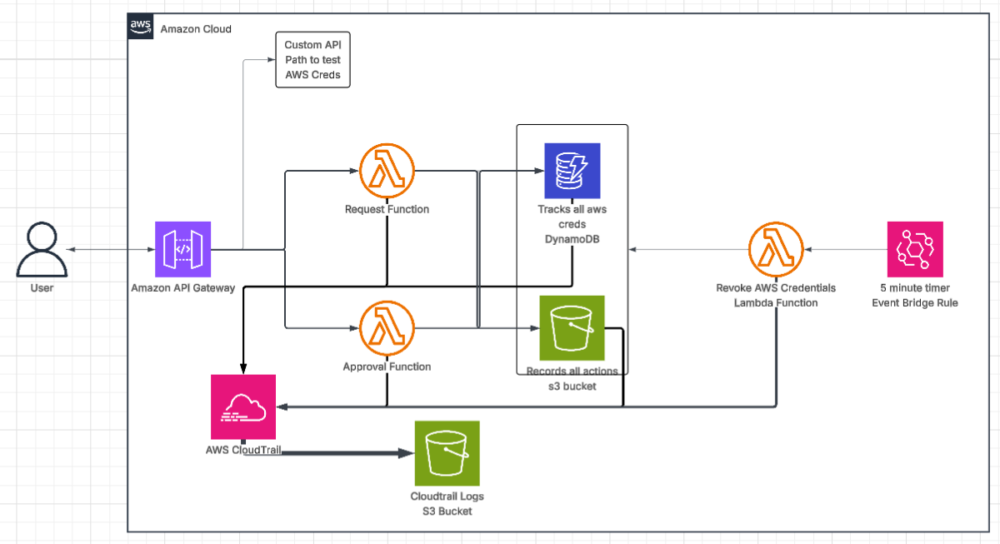

# 🔐 FedRAMP-Aligned Zero-Trust Partner Access MVP on AWS

<p align="center">
  
</p>

<p align="center">
  A production-inspired AWS security project that demonstrates approval-based, short-lived access to a protected resource with auditable evidence generation.
</p>

<p align="center">
  
  
  
  
</p>

---

## 📌 Overview

This project is a slimmed-down **zero-trust access control platform on AWS**.

It allows a partner, vendor, or external user to request temporary access to one protected AWS-backed resource. The request is reviewed by an approver. If approved, the system grants **short-lived access**, records the decision, stores evidence in S3, and supports audit review through CloudTrail.

This project is intentionally small, but it still demonstrates serious security engineering ideas:

- approval before access
- least privilege
- temporary access grants
- automatic expiration
- evidence generation
- audit visibility
- infrastructure as code

---
# Architecture


## 🧠 Problem Statement

Organizations often need to grant limited access to:

- vendors
- subcontractors
- auditors
- temporary operators
- partner engineers

This is often handled badly through:

- broad IAM permissions
- long-lived credentials
- approvals in chat or email
- weak evidence collection
- poor audit readiness

That creates real security risk:

- excess privilege
- weak accountability
- poor traceability
- difficult incident review
- inconsistent access control

---
## Demo 

https://github.com/user-attachments/assets/44800500-e0d6-48a2-9d43-d3a902cb936b


## 🎯 Project Objective

Build a minimal AWS-based workflow that grants the **right user** the **right access** for a **limited time**, only after approval, with logging and evidence captured by default.

---

## 🏗️ Architecture Diagram



---

## 🧰 Stack

<p align="center">
  
  
  
  
  
  
  
  
  
  
  
</p>

---

## ✨ What This Project Demonstrates

- zero-trust access workflow design
- approval-based access control
- scoped IAM and STS usage
- short-lived grant enforcement
- audit evidence generation in S3
- request state tracking in DynamoDB
- AWS activity visibility through CloudTrail
- reproducible infrastructure with Terraform

---

## ✅ What This Builds

- An API endpoint for access request submission
- A Lambda function to create and store access requests
- A DynamoDB table for request state tracking
- An approval workflow for allow or deny decisions
- A short-lived access grant mechanism
- An evidence storage location in S3
- KMS-backed encryption for protected records
- A revocation workflow for expired access
- CloudTrail visibility for AWS-side audit events
- Bash scripts for deployment and validation

---

## 👥 Primary Users

### Partner User
Requests temporary access to a protected resource.

### Security Approver
Reviews the request and approves or denies it.

### Auditor
Reviews evidence without requiring broad infrastructure access.

---

## 🔄 End-to-End Flow

```text
1. Partner submits access request
2. API Gateway receives the request
3. request_access Lambda validates and stores it in DynamoDB
4. Request status becomes PENDING
5. Approver reviews and triggers approval decision
6. approve_access Lambda grants scoped temporary access if approved
7. Evidence artifact is written to S3
8. revoke_access Lambda checks for expiration and revokes access
9. CloudTrail records AWS API activity for later review
🧱 Core AWS Resources
Service	Role in Architecture
Amazon API Gateway	Entry point for request submission and approval actions
AWS Lambda	Handles request, approval, and expiration logic
Amazon DynamoDB	Stores request records, states, grant metadata, and evidence references
AWS IAM / STS	Provides scoped, short-lived access to the protected resource
Amazon S3	Stores audit evidence artifacts
AWS KMS	Encrypts stored records and evidence
AWS CloudTrail	Captures AWS API activity for auditability
📂 Project Structure
fedramp-zero-trust-mvp/
├── README.md
├── docs/
│   ├── overview.md
│   ├── architecture.md
│   └── controls.md
├── infra/
│   ├── main.tf
│   ├── variables.tf
│   ├── outputs.tf
│   ├── provider.tf
│   ├── iam.tf
│   ├── kms.tf
│   ├── s3.tf
│   ├── dynamodb.tf
│   ├── lambda.tf
│   ├── api.tf
│   └── cloudtrail.tf
├── app/
│   ├── common.py
│   ├── request_access.py
│   ├── approve_access.py
│   └── revoke_access.py
└── scripts/
    ├── deploy.sh
    ├── destroy.sh
    └── invoke-request.sh

🚀 Quick Start

1. Clone the repository

git clone <your-repo-url>

cd fedramp-zero-trust-mvp

2. Move into infrastructure folder
cd infra

3. Initialize Terraform

terraform init

4. Review the execution plan

terraform plan

5. Deploy the infrastructure

terraform apply

6. Run test scripts

cd ../scripts

chmod +x *.sh

./invoke-request.sh

🧪 Validation & Testing

To validate the workflow end to end:

1. Submit a request

Invoke the request endpoint and confirm a new record is stored in DynamoDB with status:

PENDING

2. Approve the request

Trigger the approval path and verify that:

the request state changes

a temporary access path is granted

evidence is generated

3. Confirm evidence generation

Check S3 and validate that an audit artifact exists containing:

request metadata

requester identity

approval decision

time window

resource scope

timestamps

4. Confirm expiration logic

Wait for the approved duration to expire, then verify that:

access is revoked

expiration state is recorded

evidence is updated or added

5. Review CloudTrail

Inspect CloudTrail for the AWS-side events related to the workflow.

📌 Expected Behavior

Request Phase

A user submits an access request with:

identity

requested resource

requested duration

business reason

Approval Phase

An approver reviews:

who requested access

what resource was requested

why access is needed

how long access is needed

Grant Phase

If approved, the system creates a short-lived and narrowly scoped access path.

Expiration Phase

A scheduled revocation workflow removes access after the approved time window ends.

Evidence Phase

The system stores audit-ready evidence in S3 for review.

🔐 Security Architecture

Zero Trust

No user is trusted by default. Every request must be submitted, reviewed, approved, and logged.

Least Privilege

Access is limited to one approved target resource and one approved duration.

Short-Lived Access

No standing access is used for the main workflow.

Audit by Default

Requests, approvals, grants, and expirations are all recorded.

Protected Records

Evidence is stored in S3 and protected with KMS-backed encryption.

Reproducible Infrastructure

All infrastructure is provisioned with Terraform for consistency and repeatability.

🧭 Trust Boundaries

Boundary 1 — External Requester to AWS API

The requester is outside the trusted environment and must enter through validated API calls.

Boundary 2 — Lambda to Data Stores

Application logic interacts with DynamoDB and S3 using tightly scoped IAM permissions.

Boundary 3 — Temporary Access Grant to Protected Resource

Any granted access must be temporary, limited, and tied to approval.

🛡️ FedRAMP-Aligned Control Thinking

This project is not a full FedRAMP implementation.

It is a FedRAMP-aligned design exercise focused on core access and audit principles:

AC — Access Control

AU — Audit and Accountability

IA — Identification and Authentication

SC — System and Communications Protection

CM — Configuration Management

SI — System and Information Integrity

See:

docs/overview.md
docs/architecture.md
docs/controls.md
⚙️ Engineering Challenges & Solutions
Challenge	Solution
Managing approval-based access state	Stored request lifecycle data in DynamoDB with explicit state transitions
Enforcing temporary access	Used expiration logic and revocation workflow to remove access after the approved duration
Capturing audit evidence	Wrote request and decision artifacts to S3 for later review
Protecting stored records	Used KMS-backed encryption for secure evidence handling
Keeping the system reproducible	Managed AWS infrastructure using Terraform
Maintaining narrow scope	Focused the MVP on one protected resource and one approval-based workflow
📈 Production Roadmap

This project is intentionally small. To evolve it into a more production-ready design, the next steps would be:

multi-account architecture
stronger identity integration
admin web UI
policy engine for richer approvals
partner private network path
WAF and CloudFront
richer evidence reporting
SIEM integration
exception handling workflow
broader protected resource support
🚧 Current Limitations

The MVP intentionally does not include:

multi-account AWS isolation
EKS or Kubernetes
PrivateLink
full enterprise admin portal
advanced policy engine
threat detection correlation layer
multi-stage approval routing

These are known gaps and are acceptable for version one because the goal is to prove the core workflow first.

📚 Documentation
docs/overview.md
docs/architecture.md
docs/controls.md
🚀 Why This Project Matters

This project shows practical cloud security engineering through a workflow that is small enough to understand, but serious enough to demonstrate real design thinking.

Instead of relying on standing access, it shows how to build around:

approval before access
least privilege
short-lived permissions
evidence generation
auditability
repeatable infrastructure

It is a good example of building security controls into the access workflow itself, not trying to bolt them on later.

👨‍💻 About the Author
<p align="center">  </p> <p align="center"> I build hands-on cloud projects designed to reflect practical engineering work rather than simple demos. My focus is on <b>AWS infrastructure</b>, <b>Infrastructure as Code</b>, <b>automation</b>, <b>security-minded design</b>, and <b>real implementation patterns</b> that translate into production environments. </p> <p align="center">     </p> <p align="center"> <a href="https://www.linkedin.com/in/gavin-fogwe/">  </a> <a href="https://github.com/gavinxenon0-arch">  </a> <a href="https://gavinfogwe.win/">  </a> </p> ```