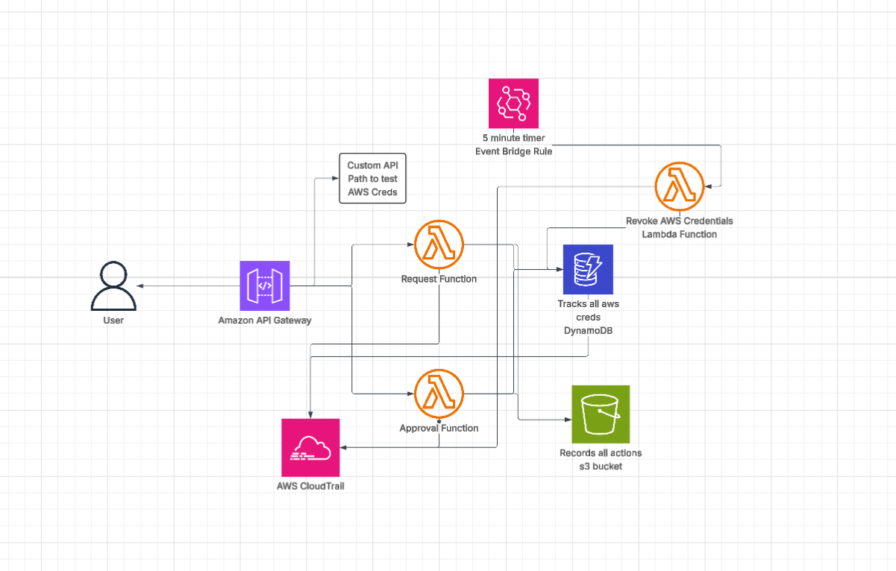

# FedRAMP-Aligned Zero-Trust Partner Access MVP on AWS

A minimal AWS project that demonstrates approval-based, time-bound partner access to one protected resource with evidence generation and auditability.





## Stack

- Terraform
- AWS Lambda
- API Gateway
- DynamoDB
- IAM / STS
- S3
- KMS
- CloudTrail
- Python
- Bash

## MVP Flow

1. Submit access request
2. Store request in DynamoDB
3. Approve or deny request
4. Grant temporary access
5. Write evidence to S3
6. Revoke after expiration
7. Review CloudTrail records

## Docs

- `docs/overview.md`
- `docs/architecture.md`
- `docs/controls.md`

# Folder Structure
```markdown
fedramp-zero-trust-mvp/
├── README.md
├── docs/
│   ├── overview.md
│   ├── architecture.md
│   └── controls.md
├── infra/
│   ├── main.tf
│   ├── variables.tf
│   ├── outputs.tf
│   ├── provider.tf
│   ├── iam.tf
│   ├── kms.tf
│   ├── s3.tf
│   ├── dynamodb.tf
│   ├── lambda.tf
│   ├── api.tf
│   └── cloudtrail.tf
├── app/
│   ├── common.py
│   ├── request_access.py
│   ├── approve_access.py
│   └── revoke_access.py
└── scripts/
    ├── deploy.sh
    ├── invoke-request.sh
    ├── approve-request.sh
    └── collect-evidence.sh
``` 


Built a zero-trust AWS access-control MVP using Terraform, API Gateway, Lambda, IAM, STS, DynamoDB, S3, KMS, and CloudTrail that enforced approval-based, time-bound access to a protected API with auditable evidence generation.